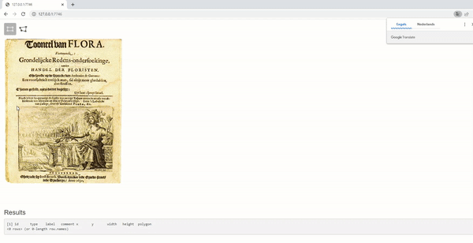

# recogito

Annotate text with your tags / Annotate areas of interests in images with your own labels

- This repository contains an R package which provides a [htmlwidget](https://www.htmlwidgets.org) library for [recogito-js](https://github.com/recogito/recogito-js) and  [annotorious](https://github.com/recogito/annotorious).
- The package allows to 
    - **annotate *text* using tags and relations between these tags** (for entity labelling / entity linking)
    - **annotate areas of interest (rectangles / polygons) in *images*** with specific labels

### Example on Image Annotation

#### Image annotation in **zoomable images** using openseadragon 

- Note: press `Shift` and click on the image to select areas


```r
library(shiny)
library(recogito)
url <- "https://upload.wikimedia.org/wikipedia/commons/a/a0/Pamphlet_dutch_tulipomania_1637.jpg"
url <- "https://iiif.ghentcdh.ugent.be/iiif/images/getuigenissen:brugse_vrije:RABrugge_I15_16999_V02:RABrugge_I15_16999_V02_01/full/full/0/default.jpg"
ui  <- fluidPage(openseadragonOutput(outputId = "anno", height = "700px"),
                 tags$h3("Results"),
                 verbatimTextOutput(outputId = "annotation_result"))
server <- function(input, output) {
  current_image <- reactiveValues(url = url)
  output$anno <- renderOpenSeaDragon({
    annotorious(inputId = "results", tags = c("Vraag", "Antwoord"), src = current_image$url, type = "openseadragon")
  })
  output$annotation_result <- renderPrint({
    read_annotorious(input$results)
  })
}
shinyApp(ui, server)
```

#### Example on image annotation - no zoomable images



```r
library(shiny)
library(recogito)
library(magick)
library(opencv)
library(sf)
url <- "https://upload.wikimedia.org/wikipedia/commons/a/a0/Pamphlet_dutch_tulipomania_1637.jpg"
ui  <- fluidPage(fluidRow(
                   column(width = 7, annotoriousOutput(outputId = "anno", height = "600px")), 
                   column(width = 5, plotOutput(outputId = "annotation_areas", height = "600px"))),
                 tags$h3("Results"),
                 verbatimTextOutput(outputId = "annotation_result"))
server <- function(input, output) {
  current_image <- reactiveValues(img = ocv_read(url), url = url)
  output$anno <- renderAnnotorious({
    annotorious(inputId = "results", tags = c("IMAGE", "TEXT"), src = current_image$url, type = "annotorious")
  })
  output$annotation_result <- renderPrint({
    read_annotorious(input$results)
  })
  output$annotation_areas <- renderPlot({
    x        <- read_annotorious(input$results)
    if(nrow(x) > 0){
      ## Extract the selected polygons and put them below each other so show the selections in annotation_areas
      areas    <- ocv_read_annotorious(data = x, image = current_image$img)
      overview <- lapply(areas, FUN = function(x) image_read(ocv_bitmap(x)))
      overview <- lapply(overview, image_border)
      overview <- image_append(do.call(c, overview), stack = TRUE)
      image_ggplot(overview)
    }
  })
}
shinyApp(ui, server)
```


### Example on Text Annotation

> Simple example in RStudio


```r
library(recogito)
txt <- "Josh went to the bakery in Brussels.\nWhat an adventure!"
x   <- recogito(text = txt)
x
```

> Example with Shiny


> With the following code

```r
library(shiny)
library(recogito)
txt <- "Tell me, O muse, of that ingenious hero who travelled far and wide after he had sacked
the famous town of Troy. Many cities did he visit, and many were the nations with whose manners and customs
he was acquainted; moreover he suffered much by sea while trying to save his own life and bring his men safely
home; but do what he might he could not save his men, for they perished through their own sheer folly in eating
the cattle of the Sun-god Hyperion; so the god prevented them from ever reaching home. Tell me, too, about all
these things, O daughter of Jove, from whatsoever source you may know them.\n
So now all who escaped death in battle or by shipwreck had got safely home except Ulysses,
and he, though he was longing to return to his wife and country, was detained by the goddess Calypso, who
had got him into a large cave and wanted to marry him. But as years went by, there came a time when the gods
settled that he should go back to Ithaca; even then, however, when he was among his own people, his troubles
were not yet over; nevertheless all the gods had now begun to pity him except Neptune, who still persecuted
him without ceasing and would not let him get home."

tagstyles <- "
.tag-PERSON   { color:red; }
.tag-LOCATION { background-color:green; }
.tag-TIME     { font-weight: bold; }
"
ui <- fluidPage(tags$head(tags$style(HTML(tagstyles))),
                tags$br(),
                recogitoOutput(outputId = "annotation_text"),
                tags$h3("Results"),
                verbatimTextOutput(outputId = "annotation_result"))

server <- function(input, output) {
  output$annotation_text <- renderRecogito({
    recogito(inputId = "annotations", text = txt, tags = c("LOCATION", "TIME", "PERSON"))
  })
  output$annotation_result <- renderPrint({
    read_recogito(input$annotations)
  })
}
shinyApp(ui, server)
```

### Installation

- For regular users, install the package from your local CRAN mirror `install.packages("recogito")`
- For installing the development version of this package: `remotes::install_github("DIGI-VUB/recogito")`

Look to documentation of the functions

```
help(package = "recogito")
```


### DIGI

By DIGI: Brussels Platform for Digital Humanities: https://digi.research.vub.be


